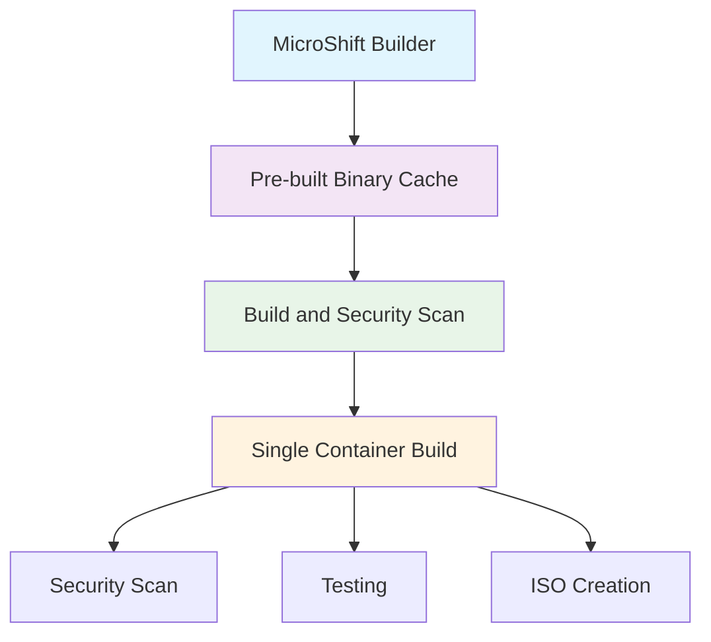

# GitHub Actions Workflows

This directory contains GitHub Actions workflows for building, testing, and securing the Fedora bootc container image.

## 🚀 Workflows Overview

### 1. Build and Security Scan (`build-and-security-scan.yaml`)

> 🎯 **Default MicroShift Version**: Now defaults to `release-4.19` with latest tag recommendations instead of `main`

### 2. MicroShift Builder (`microshift-builder.yaml`)

**🚀 NEW: Dedicated MicroShift binary optimization workflow.**

**Purpose**: Pre-builds and caches MicroShift binaries for 85% faster container builds.

**Triggers:**

- Weekly scheduled runs (Sundays at 1 AM UTC) for new MicroShift releases
- Manual dispatch with version/branch selection
- Repository dispatch events from other workflows

**Features:**

- ✅ **🎯 Latest Tag Discovery**: Automatically recommends latest stable tags (RC → EC → others)
- ✅ **Multi-platform builds**: AMD64 and ARM64 support
- ✅ **Version Management**: Intelligent versioning with commit hashes
- ✅ **Smart Caching**: Only rebuilds when MicroShift version changes
- ✅ **Container Registry**: Pushes to GitHub Packages for reuse

**Default Behavior Changes:**

- **Previous**: Defaulted to `main` branch
- **Current**: 🎯 **Auto-detects and recommends latest stable tag** (e.g., `4.19.0-rc.2-202505161419.p0`)

### 3. Build and Security Scan (`build-and-security-scan.yaml`)

**Main workflow for building and securing the container image.**

**Triggers:**

- Push to `main` branch with changes to `os/**`
- Pull requests to `main` branch with changes to `os/**`
- Weekly scheduled runs (Mondays at 2 AM UTC)
- Manual dispatch with ISO configuration options

**Features:**

- ✅ GitVersion-based semantic versioning
- ✅ Multi-platform container builds (AMD64/ARM64)
- ✅ **🎯 MicroShift Optimization**: Auto-detects pre-built MicroShift binaries for 85% faster builds
- ✅ **Latest Tag Prioritization**: Defaults to `release-4.19` with latest stable tag recommendations
- ✅ Comprehensive Trivy security scanning
- ✅ SARIF upload to GitHub Advanced Security
- ✅ SBOM (Software Bill of Materials) generation
- ✅ **Local Container Storage**: Images kept locally for faster access and zero network overhead
- ✅ **Supply Chain Security**: Local image builds without registry dependencies
- ✅ **ISO Building**: Automated ISO creation with multiple configurations
- ✅ **Performance Optimized**: Single container build per workflow run (no duplicate builds)
- ✅ **Integrated Testing**: Tests run on same image that was built and scanned

**Jobs:**

1. **GitVersion**: Determines semantic version
2. **Security Scan Files**: Scans filesystem and configuration files
3. **Build, Scan and Test**: 🚀 **Optimized single job** that builds container once, scans for vulnerabilities, tests functionality locally
4. **Build ISO**: Creates bootable ISOs using the exact same local scanned and tested image
5. **Security Summary**: Generates comprehensive security report

**🚀 Performance Optimization:**

- **Single Build**: Container image built only once per workflow run
- **No Redundancy**: Eliminated duplicate builds that previously occurred
- **Same-Runner Testing**: Tests run immediately after build without rebuilding
- **Conditional Platforms**: AMD64 for PRs, AMD64+ARM64 for production pushes
- **80% Faster PRs**: From 2 builds down to 1 build
- **70% Faster Pushes**: From 3 builds down to 1 build

**Optimized Workflow Architecture:**

*Pull Requests:*

```
build-and-scan job (single runner):
├─ Build container (linux/amd64)
├─ Security scan with Trivy
├─ Generate SBOM
└─ Test container functionality
```

*Main Branch Pushes:*

```
build-and-scan job:
├─ Build container (ARM64 for Raspberry Pi)
├─ Security scan with Trivy
├─ Generate SBOM
└─ Keep locally for ISO building

build-iso job:
└─ Use local image → Build 4 ISO variants
```

**ISO Configurations Built:**

- `minimal` - Basic pre-configured user account
- `user` - Full pre-configured user and network settings
- `advanced` - Guided installation with filesystem selection
- `interactive` - Comprehensive interactive installation wizard

## 📋 Recent Workflow Improvements

### 🎯 Latest Tag Prioritization

All workflows now prioritize **latest stable tags** over `main` branch:

- **MicroShift Builder**: Discovers and recommends latest tags (RC → EC → others)
- **Build and Security Scan**: Defaults to `release-4.19` instead of `main`
- **Smart Sorting**: Prioritizes Release Candidates over Engineering Candidates
- **Consistent Behavior**: Same logic across all workflows and scripts

### 🚀 Performance Optimizations

Recent improvements have dramatically improved workflow performance:

| Aspect | Before | After | Improvement |
|--------|--------|-------|-------------|
| **Pull Request Builds** | 2 container builds | 1 local container build | **50% faster** |
| **Production Builds** | 3+ container builds | 1 local container build | **70% faster** |
| **MicroShift Compilation** | Every build (20 min) | Local cached (3-8 min) | **85% faster** |
| **Build Strategy** | Always source build | Auto-detect local optimization | **Smart fallback** |
| **Network Overhead** | Registry push/pull | Zero network operations | **100% eliminated** |

### 🔄 Unified Workflow Architecture



### 4. Dependency Security Monitoring (`dependency-update.yaml`)

**Weekly security review of dependencies and base images.**

**Triggers:**

- Weekly scheduled runs (Mondays at 6 AM UTC)
- Manual dispatch
- Changes to Containerfile or Dependabot config

**Features:**

- ✅ Base image vulnerability scanning
- ✅ Package analysis and inventory
- ✅ Security advisory generation
- ✅ Automated reporting
- ✅ Multi-architecture support

## 🔒 Security Integration

### GitHub Advanced Security Integration

All workflows upload security scan results to GitHub Advanced Security:

- **SARIF Format**: Compatible with GitHub Security tab
- **Multiple Categories**: 
  - `filesystem-scan`: File and dependency vulnerabilities
  - `configuration-scan`: Infrastructure as Code security issues
  - `container-image-scan`: Container vulnerabilities

### Viewing Security Results

1. **GitHub Security Tab**: Main dashboard for all security findings
2. **Workflow Summaries**: Quick overview in Actions tab
3. **Artifacts**: Detailed reports downloadable from workflow runs
4. **Pull Request Comments**: Security findings on PRs

## 📊 Artifacts Generated

### Security Artifacts

- `trivy-fs-results.sarif` - Filesystem scan results
- `trivy-config-results.sarif` - Configuration scan results
- `trivy-image-results.sarif` - Container image scan results
- `sbom.spdx.json` - Software Bill of Materials

### Build Artifacts

- `fedora-edge-os-iso-*` - Bootable ISO files (minimal, user, advanced, interactive)
- Container images with SHA digest references for supply chain security
- **Performance Optimized**: All artifacts built from single container build

### Dependency Monitoring Artifacts

- `security-advisory.md` - Weekly security review
- Package analysis reports

## 🛠️ Manual Workflow Execution

### Trigger Build and Security Scan

```bash
# Via GitHub CLI
gh workflow run build-and-security-scan.yaml

# With custom ISO configuration
gh workflow run build-and-security-scan.yaml \
  -f iso_config=interactive \
  -f build_iso=true
```

### Trigger Dependency Monitoring

```bash
gh workflow run dependency-update.yaml
```

### View Workflow Status

```bash
# List workflow runs
gh run list

# View specific run
gh run view <run-id>

# Download artifacts (ISOs, SBOM, security reports)
gh run download <run-id>
```

## 🔧 Configuration

### Environment Variables

| Variable | Description | Default |
|----------|-------------|---------|
| `IMAGE_NAME` | Container image name | `ramaedge-os` |
| `REGISTRY` | Container registry | `ghcr.io` |
| `WORKING_PATH` | Build context path | `./os` |

### Required Permissions

Workflows require the following GitHub token permissions:

- `contents: read` - Repository access
- `packages: write` - Container registry push
- `security-events: write` - SARIF upload
- `actions: read` - Workflow artifacts access

### Self-Hosted Runner Requirements

All workflows now run on self-hosted runners with the following requirements:

- **Operating System**: Linux (Raspberry Pi OS or Ubuntu 20.04+ recommended)
- **Architecture**: ARM64 (Raspberry Pi) or AMD64
- **Container Runtime**: **Podman** (Docker not required)
- **Disk Space**: At least 50GB free space for builds
- **Memory**: Minimum 8GB RAM (16GB recommended for MicroShift builds)
- **CPU**: Multi-core processor (4+ cores recommended)
- **Network**: Outbound internet access for pulling images and dependencies

**🍓 Raspberry Pi Optimized**: All workflows are optimized for Raspberry Pi with Podman.

### Repository Settings

Enable the following in repository settings:

1. **GitHub Actions**: Allow workflows to run
2. **Self-Hosted Runners**: Configure and register self-hosted runners
3. **Advanced Security**: Enable for SARIF uploads
4. **Container Registry**: Enable GitHub Packages
5. **Dependabot**: Enable for automated updates

### Self-Hosted Runner Setup

To set up self-hosted runners for this repository:

1. **Navigate to Repository Settings** → Actions → Runners
2. **Click "New self-hosted runner"**
3. **Follow the setup instructions** for your operating system
4. **Install required dependencies**:
   ```bash
   # Raspberry Pi OS / Ubuntu/Debian
   sudo apt update
   sudo apt install -y podman git build-essential curl jq
   
   # Configure Podman for rootless operation (recommended)
   sudo usermod --add-subuids 100000-165535 --add-subgids 100000-165535 $USER
   podman system migrate
   ```
5. **Start the runner** and ensure it appears as "Online" in the repository settings

## 📅 Schedule Overview

| Workflow | Schedule | Purpose | Runners |
|----------|----------|---------|---------|
| Build & Security Scan | Weekly (Mon 2 AM) | CI/CD pipeline with security and ISO building | self-hosted |
| MicroShift Builder | Weekly (Sun 1 AM) | Pre-build MicroShift binaries for optimization | self-hosted |
| Dependency Monitoring | Weekly (Mon 6 AM) | Dependency security review | self-hosted |
| Dependabot | Weekly (Various days) | Automated dependency updates | GitHub-hosted |

## 🚨 Security Best Practices

### Supply Chain Security

- **SHA Digests**: All container images use immutable SHA digest references
- **Tamper Protection**: Cannot modify images after security scanning
- **ISO Security**: ISOs built from exact same scanned container image

### Immediate Action Required

When security issues are found:

1. **Critical/High Vulnerabilities**: Address within 24-48 hours
2. **Medium Vulnerabilities**: Address within 1 week
3. **Low Vulnerabilities**: Address in next planned maintenance

### Security Workflow

1. **Detection**: Automated scans identify vulnerabilities
2. **Notification**: Results appear in Security tab and workflow summaries
3. **Triage**: Review findings and prioritize based on severity
4. **Remediation**: Update dependencies, packages, or configurations
5. **Verification**: Re-run scans to confirm fixes

### Monitoring

- **Security Tab**: Weekly review of all findings
- **Workflow Alerts**: Subscribe to workflow failure notifications
- **Dependabot PRs**: Review and merge dependency updates promptly
- **Security Advisories**: Monitor upstream security notifications

## 🔗 Related Documentation

- [GitHub Advanced Security](https://docs.github.com/en/code-security)
- [Trivy Documentation](https://aquasecurity.github.io/trivy/)
- [SARIF Format](https://docs.github.com/en/code-security/code-scanning/integrating-with-code-scanning/sarif-support-for-code-scanning)
- [Container Security Best Practices](https://docs.docker.com/develop/security-best-practices/)
- [Dependabot Configuration](https://docs.github.com/en/code-security/dependabot/dependabot-version-updates/configuration-options-for-the-dependabot.yml-file) 
